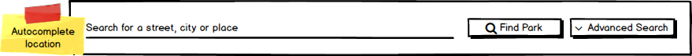
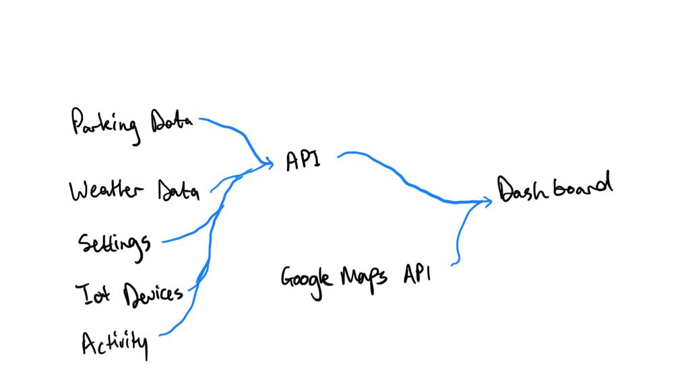
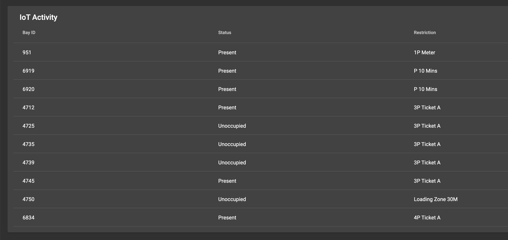

# SIT 311 GROUP PROJECT
### Members: 
---
| Name     | Job          | 
| ------------- |:-------------:|
| Tim Tattersal      | Dashboard (Front End) | 
| Marshal Welgama    | Backend API      | 
| Mehul Warde | Maps     | 
| Greg Macintyre | AWS IoT Core    | 

## Front End:
---
- Angular Js
- Do not make any changes to code
- Any requests, recomendations speak to Tim first 

#### Peview
###### Main Interface

.png)
.png)
###### Find Parking

.png)
.png)
###### Search Box

.png)


## Back End:
---

## Weather Data

><center>For the weather data we will be using the darksky.net API since it is very inutuitive<center>


You will need to get an account and make API calls

Example: 

```
GET https://api.darksky.net/forecast/0123456789abcdef9876543210fedcba/<insert co-ordinates>

This example used my API key
```

#### *Endpoints*

- /weather/current/:lat/:lng

Description: Retrieves a weather data for lattitude and longitude in reqested parameters

Example Response:

```

{
    "latitude": 42.3601,
    "longitude": -71.0589,
    "timezone": "America/New_York",
    "summary": "Drizzle",
    "temperature": 66.1,
    "apparentTemperature": 66.31,
    "temperatureHigh": 31.84,
    "temperatureLow": 28.63,
    "windSpeed": 5.59
}

```


## Parking Data

Parking Data will be gathered depending on the lat and lng of the requested parameters. 

The closest 10 locations will be autoaticly selected and added displayed. 

><center>For the Parking Data we will be using the On street parking bay sensors and on street parking bay restriction APIs on the city of melbourne dataset<center>

| Name     | URL        | 
| ------------- |:-------------:|
| On Street Parking Bay Sensors   | https://data.melbourne.vic.gov.au/Transport-Movement/On-street-Parking-Bay-Sensors/vh2v-4nfs | 
| On-street Car Park Bay Restrictions      | https://data.melbourne.vic.gov.au/Transport-Movement/On-street-Car-Park-Bay-Restrictions/ntht-5rk7 | 
 

#### *Endpoints*

- parking/:lat/:lng

Description: Retrieves 10 closest parking locations (within 500m) based on the lng and lat of requested parameters. Multiple calls will be made to both APIs. 

Example Response (Of 1 parking bay):


```
{
    "bayID": "1005",
    "location": {
        "latitude": "-37.813104376935705",
        "longitude": "144.9625311043034"
    },
    "status": "Unoccupied",
    "restrictions": [
        {
            "isFree": false,
            "duration": {"normal": "30","disablity": "60"},
            "effectiveonph": "0",
            "time": {"start": "07:30:00","end": "18:30:00"},
            "days": [1,2,3,4,5,6]
        },
        {
            "isFree": false,
            "duration": {"normal": "120", "disablity": "240"},
            "effectiveonph": "0",
            "time": {"start": "18:30:00","end": "20:30:00"},
            "days": [1,2,3,4,5,6]
        },
        {
            "isFree": true,
            "duration": {"normal": "60","disablity": "120"},
            "effectiveonph": "0",
            "time": {"start": "07:30:00","end": "18:30:00"},
            "days": [0]
        }
    ]
}

```

## IOT Devices

Amazon webservices IOT was used to show IOT activity




